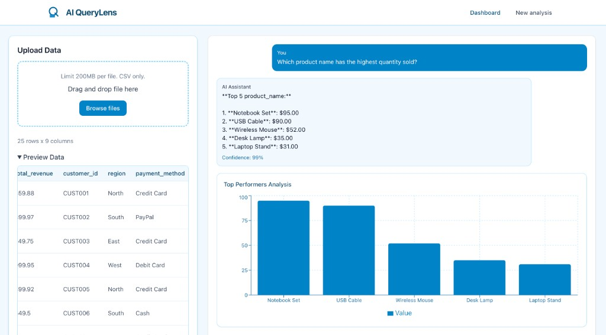

# AI QueryLens

**Author:** Victor.I

Conversational analytics: ask questions about your data in plain language and get answers with charts.



[](https://www.python.org/downloads/)
[](https://nextjs.org/)
[](https://www.djangoproject.com/)
[](LICENSE)

---

## Purpose and product context

AI QueryLens is an **AI-powered analytics dashboard** for non-technical users. You upload a CSV, see a preview, then ask questions in natural language (e.g. "Which product has the highest quantity sold?"). The system answers with text and auto-generated charts (bar, line, pie). It reduces the need for manual reporting and ad-hoc analysis.

- **Target users:** Analysts, ops, or anyone who needs quick answers from tabular data without writing queries or building reports.
- **Problem it solves:** Turning data questions into immediate, chart-backed answers without SQL or BI tools.
- **Stack:** Next.js frontend, Django REST API, Node WebSocket server, shared Python analytics and LLM logic (OpenAI or Ollama).

---

## Architecture overview

The app has three runnable parts: a **Next.js** UI, a **Django** API (upload, query, preview), and a **Node** WebSocket server that forwards chat to Django. Analytics and NLP live in shared Python (`src/`): CSV parsing, cleaning, intent matching, and an agent that uses OpenAI or Ollama with a rule-based fallback.

```
+------------------+     REST (upload, query, preview)      +------------------+
|                  | -------------------------------------->|                  |
|  Next.js (React) |                                        |  Django API      |
|  Port 3000       |<-------------------------------------- |  Port 8000       |
|                  |     JSON (answer, chart_data)          |  + in-memory    |
|                  |                                        |    dataset store |
+--------+---------+                                        +--------+---------+
         | WebSocket (query/response)                                ^
         | (optional, for streaming UX)                              |
         v                                                           |
+------------------+     POST /api/query/                    +--------+---------+
|  Node WS server  | -------------------------------------->|                  |
|  Port 3001       |<-------------------------------------- |  src/ (Python)  |
+------------------+     JSON response                      |  csv_parser,     |
                                                           |  cleaner,       |
                                                           |  openai_agent,  |
                                                           |  smart_agent    |
                                                           +------------------+
```

**Tech stack**

| Layer        | Technology                          |
|-------------|-------------------------------------|
| Frontend    | Next.js 14, TypeScript, Tailwind, Recharts |
| API         | Django REST Framework, in-memory dataset store |
| Real-time   | Node.js + ws (WebSocket proxy to Django) |
| Analytics   | Python (pandas), OpenAI or Ollama, rule-based fallback |

---

## User flow (wireflow)

1. **Upload** – User drops a CSV (or clicks Browse) in the left panel. Limit 200MB, CSV only.
2. **Preview** – Table shows first rows and column list; backend returns `suggested_questions` based on columns.
3. **Ask** – User types a question or clicks a suggestion. Request goes to Django (or via Node WS) with `dataset_id` and `question`.
4. **Answer** – Backend runs intent + analytics (ranking, aggregation, trend, etc.), returns `answer` and optional `chart_data`.
5. **Chart** – If `chart_data` is present, the right panel renders a bar/line/pie chart below the AI reply.

```
[User]                    [Frontend]                 [Backend]
  |                           |                          |
  |-- drag CSV --------------->|                          |
  |                           |-- POST /api/upload/csv ->|  parse, clean, store
  |                           |<-- dataset_id, suggested_questions
  |                           |                          |
  |-- click suggestion ------->|                          |
  |   or type question        |-- POST /api/query/ ----->|  agent.ask(), chart
  |                           |<-- answer, chart_data ---|
  |                           |  render answer + chart    |
```

---

## Quick start

**Prerequisites:** Python 3.9+, Node 18+, pip, npm. Optional: OpenAI API key or local Ollama.

1. **Clone and install**
   ```bash
   git clone https://github.com/Web8080/AI_Business_Analytics_Chatbot.git
   cd AI_Business_Analytics_Chatbot
   cp env.example .env
   # Edit .env: add OPENAI_API_KEY or leave blank to use Ollama/fallback
   ```

2. **Run from repo root (three processes)**
   ```bash
   ./scripts/run-local.sh
   ```
   Then in separate terminals run the three commands it prints:
   - Django: `PYTHONPATH=. python backend/manage.py migrate && PYTHONPATH=. python backend/manage.py runserver 8080`
   - Node: `cd node-server && npm install && node server.js`
   - Frontend: `cd frontend && npm install && npm run dev`

   Or use the restart script (kills processes on 8000/8080/3000/3001 then starts all three):
   ```bash
   ./scripts/restart-all.sh
   ```

3. **Open** [http://localhost:3000](http://localhost:3000). Upload a CSV, then ask a question or click a suggested one.

---

## Configuration

Key environment variables (see `env.example`):

| Variable | Purpose |
|----------|---------|
| `OPENAI_API_KEY` | OpenAI API; leave empty to use Ollama or rule-based fallback |
| `OLLAMA_BASE_URL`, `OLLAMA_MODEL` | Local or remote Ollama (e.g. `http://localhost:11434`, `llama3.2`) |
| `NEXT_PUBLIC_API_URL` | Django API base URL (e.g. `http://localhost:8080`) |
| `NEXT_PUBLIC_WS_URL` | Node WebSocket URL (e.g. `ws://localhost:3001`) |
| `DJANGO_API_URL` | Used by Node server to call Django (e.g. `http://localhost:8080`) |
| `SECRET_KEY` | Django secret; set a strong value in production |

---

## Dashboard features

- **Upload:** Drag-and-drop or browse; CSV only, 200MB limit.
- **Preview:** Row count, column list, and sample rows.
- **Suggested questions:** Generated from column names; click to send.
- **Chat:** Natural language questions; answers include confidence when available.
- **Charts:** Bar, line, or pie when the answer is chartable (e.g. top N, trends, distribution).

---

## Example questions

- "Which product has the highest quantity sold?"
- "What is the total revenue?"
- "Show me the top 5 products by revenue"
- "Show me a chart of the data"
- "What is the average quantity sold?"

---

## Project structure

```
backend/          # Django API (upload, query, preview, health)
frontend/         # Next.js app (upload UI, preview table, chat, charts)
node-server/      # WebSocket server (forwards queries to Django)
src/              # Shared Python: csv_parser, cleaner, conversational (openai_agent, smart_agent)
scripts/          # run-local.sh, restart-all.sh, deploy-aws.sh
docs/             # AWS checklist, hosting notes, deploy guides
env.example       # Environment template
```

---

## Deployment

- **AWS:** Build and push images with `./scripts/deploy-aws.sh us-east-1`, then create App Runner services (Django, Node) and Amplify (frontend). See [docs/AWS_DEPLOYMENT_CHECKLIST.md](docs/AWS_DEPLOYMENT_CHECKLIST.md) and [docs/aws-deploy-with-toolkit.md](docs/aws-deploy-with-toolkit.md).
- **Other:** Frontend can be deployed to Vercel, Netlify, or Amplify; backends to Railway, Render, Fly.io, or AWS. See [docs/HOSTING_AND_COST.md](docs/HOSTING_AND_COST.md).

---

## Failure modes and debugging

- **Upload returns 500:** Run Django from repo root so `src` is on the path: `PYTHONPATH=. python backend/manage.py runserver`. Check logs for the real exception.
- **Port in use:** Use another port (e.g. `runserver 8080`) and set `NEXT_PUBLIC_API_URL` and `DJANGO_API_URL` to match.
- **No charts:** Ensure the backend returns `chart_data` with `type` and `x`/`y` (or `data.data[0].x/y`). Check browser network tab for the query response.
- **"Hi-related" or irrelevant reply:** Fixed in current version (whole-word match for greetings). If you see it, ensure you have the latest `src/conversational/smart_agent.py`.

---

## Non-goals

- No authentication or multi-tenancy in this repo.
- No persistent database for datasets (in-memory only; restart clears data).
- No PDF ingestion or non-CSV upload in the main dashboard flow.
- No production-grade rate limiting or request signing; add in front of Django in production.

---

## Known debt

- Dataset store is in-memory; not suitable for multi-instance or long-lived production without a DB or cache.
- Migrations: run `python backend/manage.py migrate` from repo root when adding apps or changing models.
- Chart data shape from backend varies (flat `x`/`y` vs nested Plotly-style); frontend normalizes both.

---

## Future work

- **Persistence:** Store datasets and session state in a database (e.g. PostgreSQL) or object store; support multiple users or workspaces.
- **Auth:** Login and API keys for dashboard and API access.
- **More data sources:** PDF tables, Excel, or DB connectors with the same conversational interface.
- **Streaming:** Stream LLM tokens over WebSocket for faster perceived response.
- **Export:** Export chat history or charts (e.g. PDF report, CSV of answers).
- **Mobile:** Responsive or native client for on-the-go queries.
- **Cost and observability:** Per-request cost (OpenAI/Ollama), latency metrics, and alerting for failures.

---

## License

MIT. See [LICENSE](LICENSE) for details.

## Support

- **Docs:** [docs/](docs/) for deployment and hosting.
- **Issues:** [GitHub Issues](https://github.com/Web8080/AI_Business_Analytics_Chatbot/issues).
